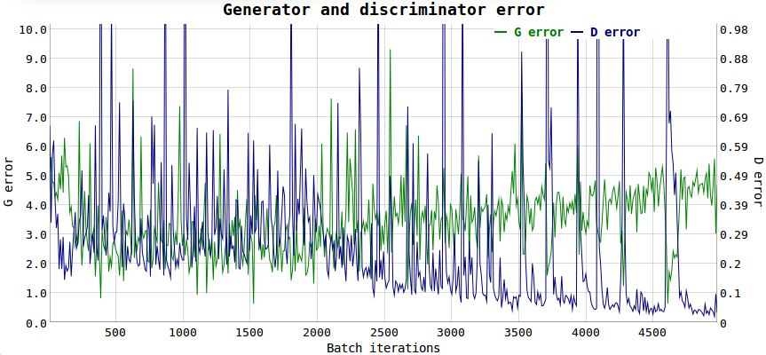

## GANs
One neural network, called the generator, generates new data instances, while the other, the discriminator, evaluates them for authenticity; i.e. the discriminator decides whether each instance of data that it reviews belongs to the actual training dataset or not.
A discriminative model tries to directly learn the conditional probability distribution P(y|x). On the other hand, a generative model tries to learn the joint probability distribution P(x,y). This can be transformed into P(y|x) using Bayes rule. However, additionally, as opposed to discriminative models, generative models can use the joint distribution P(x,y) to generate likely (x,y) samples.

Example: For MNIST, the discriminator network is a standard convolutional network that can categorize the images fed to it, a binomial classifier labeling images as real or fake. The generator is an inverse convolutional network, in a sense: While a standard convolutional classifier takes an image and downsamples it to produce a probability, the generator takes a vector of random noise and upsamples it to an image. The first throws away data through downsampling techniques like maxpooling, and the second generates new data.

## How do GANs work(1st explanation)
At first, the generator generates images. It does this by sampling a vector noise Z from a simple distribution (e.g. normal) and then upsampling this vector up to an image. In the first iterations, these images will look very noisy. Then, the discriminator is given fake and real images and learns to distinguish them. The generator later receives the “feedback” of the discriminator through a backpropagation step, becoming better at generating images. At the end, we want that the distribution of fake images is as close as possible to the distribution of real images. Or, in simple words, we want fake images to look as plausible as possible.

## How do GANs work(2nd explanation)
We got a high level overview of GANs. Now, we will go on to understand their nitty-gritty of these things.
As we saw, there are two main components of a GAN – Generator Neural Network and Discriminator Neural Network.

The Generator Network takes an random input and tries to generate a sample of data. In the above image, we can see that generator G(z) takes a input z from p(z), where  z is a sample from probability distribution p(z). It then generates a data which is then fed into a discriminator network D(x). The task of Discriminator Network is to take input either from the real data or from the generator and try to predict whether the input is real or generated. It takes an input x from pdata(x) where pdata(x) is our real data distribution. D(x) then solves a binary classification problem using sigmoid function giving output in the range 0 to 1.

Let us define the notations we will be using to formalize our GAN,

pdata(x) -> the distribution of real data  
X -> sample from pdata(x)  
p(z) -> distribution of generator  
Z -> sample from p(z)  
G(z) -> Generator Network  
D(x) -> Discriminator Network  

Now the training of GAN is done (as we saw above) as a fight between generator and discriminator. This can be represented mathematically as

In our function V(D, G) the first term is entropy that the data from real distribution (pdata(x)) passes through the discriminator (aka best case scenario). The discriminator tries to maximize this to 1. The second term is entropy that the data from random input (p(z)) passes through the generator, which then generates a fake sample which is then passed through the discriminator to identify the fakeness (aka worst case scenario). In this term, discriminator tries to maximize it to 0 (i.e. the log probability that the data from generated is fake is equal to 0). So overall, the discriminator is trying to maximize our function V.

On the other hand, the task of generator is exactly opposite, i.e. it tries to minimize the function V so that the differentiation between real and fake data is bare minimum. 

## Types of GANs
### Deep Convolutional GANs (DCGANs)
The authors of the DCGAN focused on improving the architecture of the original vanilla GAN. Among other things, they found out that:

* Batch normalization is a must in both networks.
* Fully hidden connected layers are not a good idea.
* Avoid pooling, simply stride your convolutions!
* ReLU activations are your friend (almost always).

DCGANs are also relevant because they have become one of the main baselines to implement and use GANs. 

__You might want to use DCGANs if__

* You want something better than vanilla GANs (that is, always). Vanilla GANs could work on simple datasets, but DCGANs are far better.
* You are looking for a solid baseline to compare with your fancy new state-of-the-art GAN algorithm.

From this point on, all the types of GANs that I’m going to describe will be assumed to have a DCGAN architecture, unless the opposite is specified.

### Improved DCGANs
One of the main problems related to GANs is their convergence. It is not guaranteed and despite the architecture refinement of the DCGAN, the training can still be quite unstable. In this paper, the authors propose different enhancements on the GAN training. Here are some of them:

* __Feature matching:__ instead of having the generator trying to fool the discriminator as much as possible, they propose a new objective function. This objective requires the generator to generate data that matches the statistics of the real data. In this case, the discriminator is only used to specify which are the statistics worth matching.
* __Historical averaging:__ when updating the parameters, also take into account their past values.
* __One-sided label smoothing:__ this one is pretty easy: simply make your discriminator target output from [0=fake image, 1=real image] to [0=fake image, 0.9=real image]. Yeah, this improves the training.
* __Virtual batch normalization:__ avoid dependency of data on the same batch by using statistics collected on a reference batch. It is computationally expensive, so it’s only used on the generator.

All these techniques allow the model to be better at generating high resolution images, which is one of the weak points of GANs.

__You might want to use improved DCGANs if__

* you want an improved version of the DCGAN that is able to generate higher resolution images.

### Conditional GANs (cGANs)
Conditional GANs are an extension of the GAN framework. Here we have conditional information Y that describes some aspect of the data. For example, if we are dealing with faces, Y could describe attributes such as hair color or gender. Then, this attribute information is inserted in both the generator and the discriminator.

Conditional GANs are interesting for two reasons:

* As you are feeding more information into the model, the GAN learns to exploit it and, therefore, is able to generate better samples.
* We have two ways of controlling the representations of the images. Without the conditional GAN, all the image information was encoded in Z. With cGANs, as we add conditional information Y, now these two — Z and Y — will encode different information. For example, let’s suppose Y encodes the digit of a hand-written number (from 0 to 9). Then, Z would encode all the other variations that are not encoded in Y. That could be, for example, the style of the number (size, weight, rotation, etc).

Z is fixed on rows and Y on columns. Z encodes the style of the number and Y encodes the number itself.

__Recent research__

There are lots of interesting articles on the subject. Among them, I highlight these two:
* __Learning what and where to draw__: in this, the authors propose a mechanism to tell the GAN (via text descriptions) not only how you would like the content of the image to be, but also the position of the element via bounding boxes/landmarks. Have a look at the results:

* __StackGAN__: this is similar to the previous one. In this case, they focus on improving the quality of the image by using 2 GANs at the same time: Stage-I and Stage-II. Stage-I is used to get a low-resolution image containing the “general” idea of the image. Stage-II refines Stage-I’s images with more details and higher resolution. This paper has, to my knowledge, one of the bests models when it comes to generating high-quality images. See it by yourself:
Samples from StackGAN

__You might want to use conditional GANs if__

* you have a labeled training set and want to improve the quality of the generated images.
* you would like to have explicit control over certain aspects of the images (e.g. I want to generate a red bird of this size in this specific position).

### InfoGANs
These are the GANs that are able to encode meaningful image features in part of the noise vector Z in an unsupervised manner. For example, encode the rotation of a digit.
They take Z vector and split it into two parts: C and Z.

* C will encode the semantic features of the data distribution.
* Z will encode all the unstructured noise of this distribution.

How do they force C to encode these features? They change the loss function to prevent the GAN from simply ignoring C. So, they apply an information-theoretic regularization which ensures a high mutual information between C and the generator distribution. In other words, if C changes, the generated images needs to change, too. As a result, you can’t explicitly control what type of information will be encoded in C, but each position of C should have a unique meaning. 

However, there’s a price to pay for not using label information. The limitation here is that these encodings only work with fairly simple datasets, such as MNIST digits. Moreover, you still need to “hand-craft” each position of C. So, you might consider this not to be 100% unsupervised, as you might need to provide some minor details to the model.

__You might want to use infoGANs if__

* your dataset is not very complex.
* you would like to train a cGAN but you don’t have label information.
* you want to see what are the main meaningful image features of your dataset and have control over them.

### Wasserstein GANs
GANs have always had problems with convergence and, as a consequence, you don’t really know when to stop training them. In other words, the loss function doesn’t correlate with image quality. This is a big headache because:

* you need to be constantly looking at the samples to tell whether you model is training correctly or not.
* you don’t know when to stop training (no convergence).
* you don’t have a numerical value that tells you how well are you tuning the parameters.

For example, see these two uninformative loss functions plots of a DCGAN perfectly able to generate MNIST samples:

Do you know when to stop training just by looking at this figure? Me neither.

This interpretability issue is one of the problems that Wasserstein GANs aims to solve. How? GANs can be interpreted to minimize the Jensen-Shannon divergence, which is 0 if the real and fake distribution don’t overlap (which is usually the case). So, instead of minimizing the JS divergence, the authors use the Wasserstein distance, which describes the distance between the “points” from one distribution to the other.

So, WassGAN has a loss function that correlates with image quality and enables convergence. It is also more stable, meaning that it is not as dependent on the architecture.

This is the plot of the WassGAN loss function. The lower the loss, the higher the image quality. Neat!

__You might want to use Wasserstein GANs if__

* you are looking for a state-of-the-art GAN with the highest training stability.
* you want an informative and interpretable loss function.

#### For more refer these:
1. http://guimperarnau.com/blog/2017/03/Fantastic-GANs-and-where-to-find-them
2. https://www.analyticsvidhya.com/blog/2017/06/introductory-generative-adversarial-networks-gans/