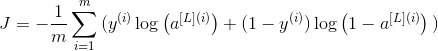
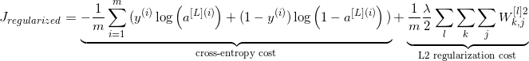

### 1. What is deep learning
The area of machine learning which focuses on deep artificial neural networks which are loosely inspired by brains. Today it has its application in various fields such as computer vision, speech recognition, natural language processing.

### 2. Why are deep networks better than shallow ones?
There are studies which say that both shallow and deep networks can fit at any function, but as deep networks have several hidden layers often of different types so they are able to build or extract better features than shallow models with fewer parameters (Shallow ones have very less hidden layers).

### 3. What is a cost function?
A cost function is a measure of the accuracy of the neural network with respect to given training sample and expected output. It is a single value, nonvector as it gives the performance of the neural network as a whole.  

__Mean Squared Error function:-__  

MSE=1/n( n∑i=1 (Yi–Y^i)^2 )  

Where Y^ and desired value Y is what we want to minimize..

### 4. What is a gradient descent?
Gradient descent is basically an optimization algorithm, which is used to learn the value of parameters that minimizes the cost function. It is an iterative algorithm which moves in the direction of steepest descent as defined by the negative of the gradient. We compute the gradient descent of the cost function for given parameter and update the parameter by the below formula:

Θ := Θ – α * ∂J(Θ)/∂Θ

Where Θ – is the parameter vector, α – learning rate, J(Θ) – is a cost function.

### 5. What is a backpropagation?
Backpropagation is training algorithm used for multilayer neural network. In this method, we move the error from an end of the network to all weights inside the network and thus allowing efficient computation of the gradient. It can be divided into several steps as follows:-

* Forward propagation of training data in order to generate output.
* Then using target value and output value, error derivative can be computed with respect to output activation.
* Then we back propagate for computing derivative of error with respect to output activation on previous and continue this for all the hidden layers.
* Using previously calculated derivatives for output and all hidden layers we calculate error derivatives with respect to weights.
* And then we update the weights.

### 6. Explain the following three variants of gradient descent: batch, stochastic and mini-batch?
__Stochastic Gradient Descent:__ Here we use only single training example. It means the batch size is 1.

__Batch Gradient Descent:__ Here we calculate the gradient for the whole dataset and perform the update at each iteration. It means the batch size is equal to number of samples(examples) .

__Mini-batch Gradient Descent:__ Here mini-batch of samples is used. It means that the batch size is between 1 and number of samples.

### 7. What are the benefits of mini-batch gradient descent?
Below are the benefits of mini-batch gradient descent:
* This is more efficient compared to stochastic gradient descent.
* Mini-batches allows help to approximate the gradient of entire training set which helps us to avoid local minima.

### 8. What is data normalization and why do we need it?
The goal of normalization is to change the values of numeric columns in the dataset to a common scale, without distorting differences in the ranges of values. For machine learning, every dataset does not require normalization. It is required only when features have different ranges.

### 9. What is weight initialization in neural networks?
Weight initialization is one of the very important steps. A bad weight initialization can prevent a network from learning but good weight initialization helps in giving a quicker convergence and a better overall error. Biases can be generally initialized to zero. The rule for setting the weights is to be close to zero without being too small.

### 10. What is an auto-encoder?
* Autoencoders are neural networks trained to reconstruct their original input.
* An Autoencoder is a form of feature extraction algorithm.
* Autoencoders can be stacked.
* The output of an autoencoder is the middle layer, the representation for each data point.
* We can use the features generated by an AE in any other algorithm, for example for classification.

### 11. Is it OK to connect from a Layer 4 output back to a Layer 2 input?
Yes, this can be done considering that layer 4 output is from previous time step like in RNN.

### 12. What is the role of the activation function?
The activation function is used to introduce non-linearity into the neural network helping it to learn more complex function. Without it the neural network would only be only able to learn linear functions.

### 13. Why Is Zero Initialization Not A Recommended Weight Initialization Technique?
As a result of setting weights in the network to zero, all the neurons at each layer will produce the same output and the same gradients during backpropagation and thus, the network can’t learn at all because there is no source of asymmetry between neurons. That is why we need to add randomness to weight initialization process.

### 14. What Are Hyperparameters, Provide Some Examples?
Hyperparameters as opposed to model parameters can’t be learn from the data, they are set before training phase.

__Learning rate:__ It determines how fast we want to update the weights during optimization. If learning rate is too small, gradient descent can be slow to find the minimum and if it’s too large gradient descent may not converge(it can overshoot the minima).

__Number of epochs:__ Epoch is defined as one forward pass and one backward pass of all training data. It means that one epoch is completed when we go over our data (fully) once.

__Batch size:__ The number of training examples in one forward/backward pass.

Let’s make this concrete with a small example.

Assume you have a dataset with 200 samples (rows of data) and you choose a batch size of 5 and 1,000 epochs.

This means that the dataset will be divided into 40 batches, each with five samples. The model weights will be updated after each batch of five samples. This also means that one epoch will involve 40 batches or 40 updates to the model.

With 1,000 epochs, the model will be exposed to or pass through the whole dataset 1,000 times. That is a total of 40,000 batches during the entire training process.

### 15. What Is A Dropout?
Dropout is a regularization technique for reducing overfitting in neural networks. At each training step we randomly drop out (set to zero) a set of nodes.

### 16. What is the difference between Bias and Variance?
__Bias:__ Bias is how far are the predicted values from the actual values. If the average predicted values are far off from the actual values then the bias is high. High bias causes algorithm to miss relevant relationship between input and output variable. When a model has a high bias then it implies that the model is too simple and does not capture the complexity of data thus underfitting the data.

__Variance:__ Variance occurs when the model performs good on the trained dataset but does not do well on a dataset that it is not trained on, like a test dataset or validation dataset. 
Variance tells us how scattered are the predicted value from the actual value. High variance causes overfitting that implies that the algorithm models random noise present in the training data.
When a model has a high variance then the model becomes very flexible and tune itself to the data points of the training set. When a high variance model encounters a different data point that it has not learnt then it cannot make right prediction.

### 17. How is KNN different from K-means clustering?
__K-means__ is a clustering algorithm that tries to partition a set of points into K sets (clusters) such that the points in each cluster tend to be near each other. It is unsupervised because the points have no external classification.

__K-nearest neighbors__ is a classification (or regression) algorithm that in order to determine the classification of a point, combines the classification of the K nearest points. It is supervised because you are trying to classify a point based on the known classification of other points.

###  18. Explain what is precision and Recall?
__Recall:__ It is known as a true positive rate. The number of positives that your model has claimed compared to the actual defined number of positives available throughout the data.

__Precision:__ It is also known as a positive predicted value. This is more based on the prediction. It is a measure of a number of accurate positives that the model claims when compared to the number of positives it actually claims.

### 19. What is the difference between Type 1 and Type 2 errors?
Type 1 error is classified as a false positive. I.e. This error claims that something has happened but the fact is nothing has happened. It is like a false fire alarm. The alarm rings but there is no fire.
Type 2 error is classified as a false negative. I.e. This error claims that nothing has happened but the fact is that actually, something happened at the instance.

### 20. What is the F1 score? How is F1 score is used?
The F1 score is defined as a measure of a model’s performance. The average of Precision and Recall of a model is nothing but F1 score measure. Based on the results, the F1 score is 1 then it is classified as best and 0 being the worst.

### 21. How can you ensure that you are not overfitting with a particular model?
In Machine Learning concepts, they are three main methods or processes to avoid overfitting:
* Firstly, keep the model simple
* Must and should use cross validation techniques
* It is mandatory to use regularization techniques, for example, LASSO.

### 22. How to handle or missing data in a dataset?
An individual can easily find missing or corrupted data in a data set either by dropping the rows or columns. On contrary, they can decide to replace the data with another value.
In Pandas they are two ways to identify the missing data, these two methods are very useful.
isnull() and dropna().
 
### 23. What is transfer learning ?
A deep learning model trained on a specific task can be reused for different problem in the same domain even if the amount of data is not that huge.

### 24. Why do we need a validation set and test set? What is the difference between them?
When training a model, we divide the available data into three separate sets:
* __The training dataset__ is used for fitting the model’s parameters. However, the accuracy that we achieve on the training set is not reliable for predicting if the model will be accurate on new samples.
* __The validation dataset__ is used to measure how well the model does on examples that weren’t part of the training dataset. The metrics computed on the validation data can be used to tune the hyperparameters of the model. However, every time we evaluate the validation data and we make decisions based on those scores, we are leaking information from the validation data into our model. The more evaluations, the more information is leaked. So we can end up overfitting to the validation data, and once again the validation score won’t be reliable for predicting the behaviour of the model in the real world.
* __The test dataset__ is used to measure how well the model does on previously unseen examples. It should only be used once we have tuned the parameters using the validation set.

So if we omit the test set and only use a validation set, the validation score won’t be a good estimate of the generalization of the model.

### 25. What is stratified cross-validation and when should we use it?
Cross-validation is a technique for dividing data between training and validation sets. On typical cross-validation this split is done randomly. But in stratified cross-validation, the split preserves the ratio of the categories on both the training and validation datasets.

Stratified cross-validation may be applied in the following scenarios:
* __On a dataset with multiple categories:__ The smaller the dataset and the more imbalanced the categories, the more important it will be to use stratified cross-validation.
* __On a dataset with data of different distributions:__ For example, in a dataset for autonomous driving, we may have images taken during the day and at night. If we do not ensure that both types are present in training and validation, we will have generalization problems.

### 26. Why do ensembles typically have higher scores than individual models?
An ensemble is the combination of multiple models to create a single prediction. The key idea for making better predictions is that the models should make different errors. That way the errors of one model will be compensated by the right guesses of the other models and thus the score of the ensemble will be higher.

We need diverse models for creating an ensemble. Diversity can be achieved by:
* Using different ML algorithms. For example, you can combine logistic regression, k-nearest neighbors, and decision trees.
* Using different subsets of the data for training. This is called bagging.
* Giving a different weight to each of the samples of the training set. If this is done iteratively, weighting the samples according to the errors of the ensemble, it’s called boosting.

### 27. What is regularization? Can you give some examples of regularization techniques?
Regularization is any technique that aims to improve the validation score, sometimes at the cost of reducing the training score.

Some regularization techniques:
* L1 tries to minimize the absolute value of the parameters of the model. It produces sparse parameters.
* L2 tries to minimize the square value of the parameters of the model. It produces parameters with small values.
* Dropout is a technique applied to neural networks that randomly sets some of the neurons’ outputs to zero during training. This forces the network to learn better representations of the data by preventing complex interactions between the neurons: Each neuron needs to learn useful features.
* Early stopping will stop training when the validation score stops improving, even when the training score may be improving. This prevents overfitting on the training dataset.

The standard way to avoid overfitting is called __L2 regularization__. It consists of appropriately modifying your cost function, from:

To:

### 28. What is the curse of dimensionality? Can you list some ways to deal with it?
The curse of dimensionality is when the training data has a high feature count, but the dataset does not have enough samples for a model to learn correctly from so many features.

There are different options to fight the curse of dimensionality:
* __Feature selection.__ Instead of using all the features, we can train on a smaller subset of features.
* __Dimensionality reduction.__ There are many techniques that allow to reduce the dimensionality of the features. Principal component analysis (PCA) and using autoencoders are examples of dimensionality reduction techniques.
* __L1 regularization.__ Because it produces sparse parameters, L1 helps to deal with high-dimensionality input.
* __Feature engineering.__ It’s possible to create new features that sum up multiple existing features. For example, we can get statistics such as the mean or median.

### 29. What is an imbalanced dataset? Can you list some ways to deal with it?
An imbalanced dataset is one that has different proportions of target categories.

There are different options to deal with imbalanced datasets:
* __Oversampling or undersampling__. Instead of sampling with a uniform distribution from the training dataset, we can use other distributions so the model sees a more balanced dataset.
* __Data augmentation__. We can add data in the less frequent categories by modifying existing data in a controlled way. In the example dataset, we could flip the images with illnesses, or add noise to copies of the images in such a way that the illness remains visible.
* __Using appropriate metrics__. In the example dataset, if we had a model that always made negative predictions, it would achieve a precision of 98%. There are other metrics such as precision, recall, and F-score that describe the accuracy of the model better when using an imbalanced dataset.

### 30. What are some factors that explain the success and recent rise of deep learning?
The success of deep learning in the past decade can be explained by three main factors:

* __More data__. The availability of massive labeled datasets allows us to train models with more parameters and achieve state-of-the-art scores. Other ML algorithms do not scale as well as deep learning when it comes to dataset size.
* __GPU__. Training models on a GPU can reduce the training time by orders of magnitude compared to training on a CPU. Currently, cutting-edge models are trained on multiple GPUs or even on specialized hardware.
* __Improvements in algorithms__. ReLU activation, dropout, and complex network architectures have also been very significant factors.

### 31. What is data augmentation? Can you give some examples?
Data augmentation is a technique for synthesizing new data by modifying existing data in such a way that the target is not changed, or it is changed in a known way.
Computer vision is one of fields where data augmentation is very useful. There are many modifications that we can do to images:
* Resize
* Horizontal or vertical flip
* Rotate
* Add noise
* Deform
* Modify colors

### 32. What are convolutional networks? Where can we use them?
Convolutional networks are a class of neural network that use convolutional layers instead of fully connected layers. On a fully connected layer, all the output units have weights connecting to all the input units. On a convolutional layer, we have some weights that are repeated over the input.

The advantage of convolutional layers over fully connected layers is that the number of parameters is far smaller. This results in better generalization of the model. For example, if we want to learn a transformation from a 10x10 image to another 10x10 image, we will need 10,000 parameters if using a fully connected layer. If we use two convolutional layers, the first one having nine filters and the second one having one filter, with a kernel size of 3x3, we will have only 90 parameters.

### 33. Quick notes
General flow for machine learning/deep learning
1. Gathering data
2. Pre-processing data
3. Training model
4. Evaluating model
5. Optimizing model's accuracy
	- Hyperparameter Tuning (learning rate, epochs)
	- address Overfitting (get more data, reduce model complexity, regularization)
	- Data Augmentation (flipping, blurring, zooming)
	- Dropout (reduces co-dependency of neurons)

#### Activation functions:
- linear function
- sigmoid (for binary classification)
- tanh
- relu (max(0, x))
- leaky relu

#### Loss Functions
- RMS(root mean squared) error for regression
- Binary cross entropy for binary classification
- Multi-class cross entropy for multi-class classification

#### Optimizers
- Gradient descent (GD)
- Stochastic GD (GD but with partial dataset)
- Adagrad (adapts learning rate to individual features)
- rmsprop(keeps gradient in a window)
- adam
