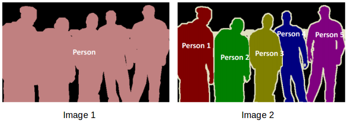
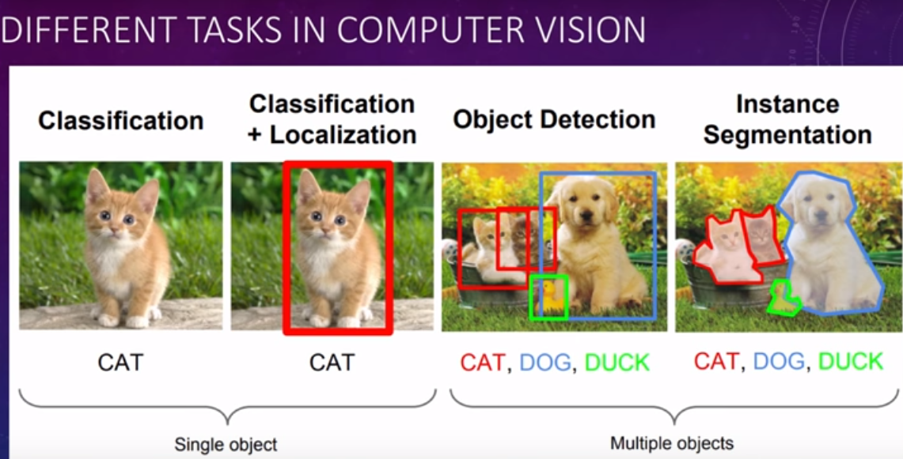

## General object detection framework:

Typically, there are three steps in an object detection framework.

1. First, a model or algorithm is used to generate regions of interest or region proposals. These region proposals are a large set of bounding boxes spanning the full image (that is, an object localisation component).
2. In the second step, visual features are extracted for each of the bounding boxes, they are evaluated and it is determined whether and which objects are present in the proposals based on visual features (i.e. an object classification component).
3. In the final post-processing step, overlapping boxes are combined into a single bounding box (that is, non maximum suppression).

## Intuition of RCNN

Instead of working on a massive number of regions, the RCNN algorithm proposes a bunch of boxes in the image and checks if any of these boxes contain any object. RCNN uses selective search to extract these boxes from an image (these boxes are called regions).

1. We first take a pre-trained convolutional neural network.
2. Then, this model is retrained. We train the last layer of the network based on the number of classes that need to be detected.
3. The third step is to get the Region of Interest for each image. We then reshape all these regions so that they can match the CNN input size.
4. After getting the regions from CNN, we train SVM to classify objects and background. For each class, we train one binary SVM.
5. Finally, we train a linear regression model to generate tighter bounding boxes for each identified object in the image.

#### Problems with RCNN:
Training an RCNN model is expensive and slow thanks to the below steps:

* Extracting 2,000 regions for each image based on selective search
* Extracting features using CNN for every image region. Suppose we have N images, then the number of CNN features will be N*2,000
* The entire process of object detection using RCNN has three models:
  1. CNN for feature extraction
  2. Linear SVM classifier for identifying objects
  3. Regression model for tightening the bounding boxes.

All these processes combine to make RCNN very slow. It takes around 40-50 seconds to make predictions for each new image.

## Intuition of RCNN

1. As with the earlier two techniques, we take an image as an input.
2. This image is passed to a ConvNet. Then selective search is applied on the output of ConvNet which generates the Regions of Interest.
3. A RoI pooling layer is applied on all of these regions to reshape them as per the input of the ConvNet. Then, each region is passed on to a fully connected network.
4. A softmax layer is used on top of the fully connected network to output classes. Along with the softmax layer, a linear regression layer is also used parallely to output bounding box coordinates for predicted classes.

#### Problems with Fast RCNN:

But even Fast RCNN has certain problem areas. It also uses selective search as a proposal method to find the Regions of Interest, which is a slow and time consuming process. It takes around 2 seconds per image to detect objects, which is much better compared to RCNN. But when we consider large real-life datasets, then even a Fast RCNN doesn’t look so fast anymore.

## Intuition of Faster RCNN

Faster RCNN is the modified version of Fast RCNN. The major difference between them is that Fast RCNN uses selective search for generating Regions of Interest, while Faster RCNN uses “Region Proposal Network”, aka RPN. RPN takes image feature maps as an input and generates a set of object proposals, each with an objectness score as output.

1. We take an image as input and pass it to the ConvNet which returns the feature map for that image.
2. Region proposal network is applied on these feature maps. This returns the object proposals along with their objectness score.
3. A RoI pooling layer is applied on these proposals to bring down all the proposals to the same size.
4. Finally, the proposals are passed to a fully connected layer which has a softmax layer and a linear regression layer at its top, to classify and output the bounding boxes for objects.

#### Problems with Faster RCNN:
All of the object detection algorithms we have discussed so far use regions to identify the objects. The network does not look at the complete image in one go, but focuses on parts of the image sequentially. This creates two complications:

* The algorithm requires many passes through a single image to extract all the objects
* As there are different systems working one after the other, the performance of the systems further ahead depends on how the previous systems performed

##### For more on RCNN, Fast RCNN, Faster RCNN, visit: 
https://www.analyticsvidhya.com/blog/2018/10/a-step-by-step-introduction-to-the-basic-object-detection-algorithms-part-1/

## Working of YOLO:

1. First, it divides the image into a grid of cells. The size of these cells vary depending on the size of the input. Let's understand this in detail.

	* The input image to a neural network needs to be in a certain format called a blob. 
	* After a frame is read from the input image or video stream, it is passed through the __blobFromImage__ function to convert it to an input blob for the neural network. 
	* In this process, it scales the image pixel values to a target range of 0 to 1 using a scale factor of 1/255. It also resizes the image to the given size of, say (416, 416), without cropping.

2. Each cell is then responsible for predicting a number of boxes in the image. These boxes are predicted by passing the blob generated as input to the network and a forward pass is run to get a list of predicted bounding boxes as the network’s output. 
3. For each bounding box, the network also predicts the confidence that the bounding box actually encloses an object, and the probability of the enclosed object being a particular class.
4. Most of these bounding boxes are eliminated because their confidence is low or because they are enclosing the same object as another bounding box with very high confidence score. This technique is called non-maximum suppression. 
Let's understand Steps 3 & 4 in detail.
	* The network outputs bounding boxes each of which is represented by a vector of number of classes + 5 elements.
	* The first 4 elements represent the center_x, center_y, width and height. The fifth element represents the confidence that the bounding box encloses an object.
	* The rest of the elements are the confidence associated with each class (i.e. object type). The box is assigned to the class corresponding to the highest score for the box.
	* The highest score for a box is also called its confidence. If the confidence of a box is less than the given threshold, the bounding box is dropped and not considered for further processing.
	* The boxes with their confidence equal to or greater than the confidence threshold are then subjected to Non Maximum Suppression. This would reduce the number of overlapping boxes.

#### Below are the exact dimensions and steps that the YOLO algorithm follows:

* Takes an input image of shape (608, 608, 3)
* Passes this image to a convolutional neural network (CNN), which returns a (19, 19, 5, 85) dimensional output
* The last two dimensions of the above output are flattened to get an output volume of (19, 19, 425):
	* Here, each cell of a 19 X 19 grid returns 425 numbers
	* 425 = 5 * 85, where 5 is the number of anchor boxes per grid
	* 85 = 5 + 80, where 5 is (pc, bx, by, bh, bw) and 80 is the number of classes we want to detect
* Finally, we do the IoU and Non-Max Suppression to avoid selecting overlapping boxes

_For more on YOLO refer these:_
1. https://www.learnopencv.com/deep-learning-based-object-detection-using-yolov3-with-opencv-python-c/
2. https://www.analyticsvidhya.com/blog/2018/12/practical-guide-object-detection-yolo-framewor-python/

## The Different Types of Image Segmentation
We can broadly divide image segmentation techniques into two types. Consider the below images:

* In image 1, every pixel belongs to a particular class (either background or person). Also, all the pixels belonging to a particular class are represented by the same color (background as black and person as pink). This is an example of semantic segmentation
* Image 2 has also assigned a particular class to each pixel of the image. However, different objects of the same class have different colors (Person 1 as red, Person 2 as green, background as black, etc.). This is an example of instance segmentation

