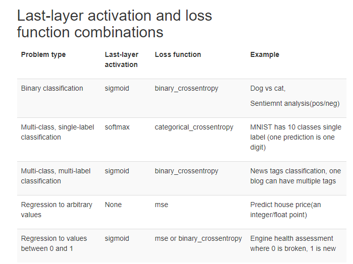

# [ERROR] 1. MinGW issue with conda python
If you are facing the issue "cannot find -lvcruntime140" while building from setup.py file then follow the steps below:

1. First install the libpython and toolchain by using the following command:
`conda install libpython m2w64-toolchain`

2. Open distutils.cfg file present in `<Path to Anaconda Installation>\Lib\distutils\` . If it is not there, create one. Type the following in the file:
```
[build]
compiler = mingw32
```
3. Save and close the file.

4. Open the file cygwinccompiler.py which is located in <Path to Anaconda Installation>\Lib\distutils\ and comment the following:
* On line 158 to 161
 ```
	else:
            # Include the appropriate MSVC runtime library if Python was built
            # with MSVC 7.0 or later.
            self.dll_libraries = get_msvcr()
```

* On line 327
`self.dll_libraries = get_msvcr()`

What commenting these lines does is to tell cygwin compiler to not look for visual studio.

5. Save the file cygwinccompiler.py

6. Make sure that MinGW is in System Environment Path (below paths):
```
<MinGW installation path>\bin
<MinGW installation path>\msys\1.0\bin
```

# [TIPS] 2. Multi-level import python
Use when importing python modules from one(or more) directory above current working directory.

Suppose you have the following folder structure:
```
        Directory_1/
                - file1.py
                - Directory_2/
                            - file2.py
                            - file3.py
                - Directory_3/
                            - file4.py

```
* Now you want to import a function from `file1.py` and `file2.py` each in `file4.py`, then from `file4.py` you would do:

```
import sys
sys.path.append('../')
from Directory_2.file2 import any_function_1
```
The second line tells the compiler to append one directory above to system path.

* For `file1.py` you would use:
```
import sys
sys.path.append('../../')
from Directory_1.file1 import any_function_2
```   
The second line here tells the compiler to append two directory above to system path.

# [TIPS] 3. Last-layer activation and loss function combinations

